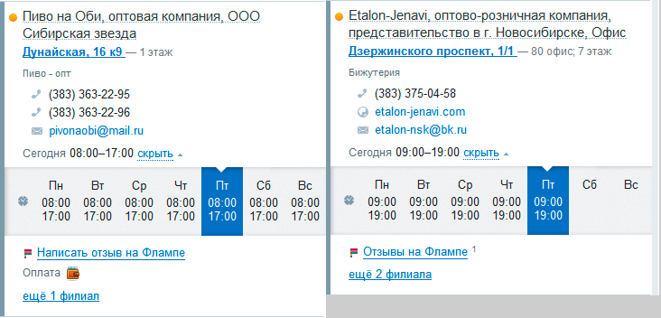
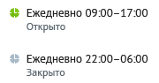
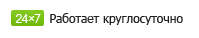
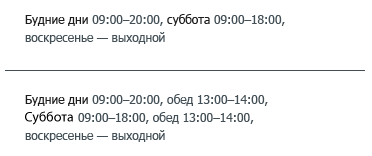
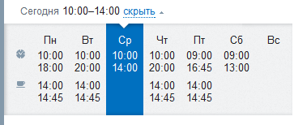
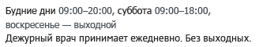
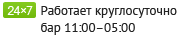
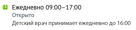
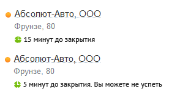
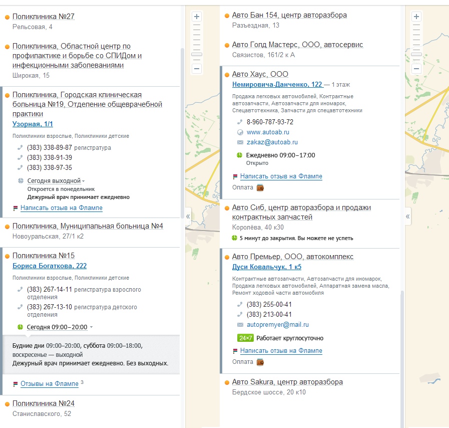

### Цель

Облегчить работу пользователей с информацией о времени работы организаций.&nbsp;

### Упрощение способа отображения времени работы

Сегодня мы отображаем время работы в виде таблицы. Такая форма отображения избыточна для наиболее распространённых расписаний организаций: когда&nbsp;организации&nbsp;имеют одинаковый график во все рабочие дни без обеда и фиксированные выходные.&nbsp;

Примеры:&nbsp;

##### Правила отображения в кратком ("свёрнутом") виде

1.  Для случая, когда организация имеет одинаковый график во все дни недели без обеда: пишем "Ежедневно [время работы]", время работы не раскрывается по клику.&nbsp;

&nbsp;

&nbsp; &nbsp; &nbsp;2. Если организация работает круглосуточно: показываем строку "работает круглосуточно", время работы не&nbsp;раскрывается&nbsp;по клику.

&nbsp; &nbsp; &nbsp;3. Если организация работает по разному расписанию в разные дни, имеет перерывы на обед или выходные &nbsp;- время работы раскрывается по клику.

&nbsp; &nbsp; &nbsp;

&nbsp; &nbsp; &nbsp; &nbsp; &nbsp;3.1. Если у организации сегодня есть обед - говорим об этом в свёрнутом виде.

&nbsp; &nbsp; &nbsp; &nbsp; &nbsp;

&nbsp; &nbsp; &nbsp; &nbsp; &nbsp;3.2. Если у организации сегодня выходной.

&nbsp; &nbsp; &nbsp; &nbsp; &nbsp;&nbsp;

##### Правила отображения полного ("развёрнутого") вида

&nbsp; &nbsp;По данным новосибирского каталога (общее кол-во фирм - 51 255):

&nbsp; &nbsp; &nbsp; компаний, работающих ежедневно по одному графику -&nbsp;15 203 (29,66%)

&nbsp; &nbsp; &nbsp; компаний, имеющих не более трёх интервалов работы (пн-пт, сб, вс) - 49 923 (95,45%)

&nbsp; &nbsp; &nbsp;&nbsp;компании, имеющих обеденный перерыв - 4 554 (8,88%)

&nbsp; &nbsp;В развернутом виде заменяем табличное представление на строчное, для случаев &nbsp;когда у организации два или три интервала работы:

&nbsp; При форматировании строчного представления используем следующие правила

&nbsp; &nbsp; 1. Если время работы одинаково с понедельника по пятницу - оформляем строкой "Будние дни"

&nbsp; &nbsp; 2. Если время работы одинаково, для двух дней подрят - оформляем строкой с перечислением каждого дня "понедельник, вторник"

&nbsp; &nbsp; 3. Если время работы одинаково для трёх и более дней - оформляем периодом "пятница - среда"

&nbsp; &nbsp; 4. Каждая группа должна начинаться с новой строки.&nbsp;

&nbsp; &nbsp;Несмотря на то, что компаний с большим количеством интервалов работы немного (менее 5%), как правило, это социально значимые организации. Например,&nbsp;УФМС в Москве&nbsp;-&nbsp;[http://go.2gis.ru/nzit](http://go.2gis.ru/nzit)&nbsp;. В случае, если у&nbsp;организации более трёх интервалов работы,&nbsp;необходимо оставить табличное представление.&nbsp;

&nbsp; &nbsp;

##### Отображения комментария ко времени работы

Если ко времени работы организации указан комментарий, отображаем его только в раскрытой карточке:&nbsp;

В случае если время работы организации одинаково для всех дней недели или организация работает круглосуточно комментарий отображается после краткой записи

&nbsp;

### Подсказки ко времени работы

В свёрнутом виде у времени работы появляются подсказки. Задача - помочь пользователю определить работает организация сейчас или нет.

Используется цветовое кодирование иконки (зеленая - если организация работает, серая - если организация закрыта) и тестовая подсказка.

**Финальные версии текстов для подсказок**
<table>
    <tr>
        <th>График работы </th>
        <th>Подсказка</th>
    </tr>
    <tr>
        <td>Сегодня 09:00 – 20:00 </td>
        <td><b>Открыто до 20:00</b></td>
    </tr>
    <tr>
        <td>Сегодня 09:00 – 20:00 </td>
        <td><b>Откроется завтра</b></td>
    </tr>
    <tr>
        <td>Сегодня 09:00 – 20:00 </td>
        <td><b>Закроется через 15 минут</b></td>
    </tr>
    <tr>
        <td>Сегодня 09:00 – 20:00 </td>
        <td><b>Открыто. Меньше 5 минут до закрытия</b></td>
    </tr>
    <tr>
        <td>Сегодня 09:00 – 20:00 </td>
        <td><b>Закроется через 5 минут</b></td>
    </tr>
    <tr>
        <td>Сегодня 09:00 – 20:00, обед 13:00 – 14:00 </td>
        <td><b>Закроется через 15 минут</b></td>
    </tr>
    <tr>
        <td>Сегодня 09:00 – 20:00, обед 13:00 – 14:00</td>
        <td><b>Откроется через 15 минут</b></td>
    </tr>
    <tr>
        <td>Сегодня 09:00 – 20:00 </td>
        <td><b>Откроется через 15 минут</b></td>
    </tr>
    <tr>
        <td>Сегодня выходной</td>
        <td><b>Откроется в понедельник</b></td>
    </tr>
</table>

##### Подсказки при использовании фильтра "Работает сейчас"

Если пользователь отфильтровал результаты поиска по "Работает сейчас" подсказка должна отображаться и для скрытой карточки предприятия.&nbsp;

### Дополнительные требования и&nbsp;ограничения

1.  Время работы оцениваем по часовому поясу проекта в котором находится организация. Т.е. если человек из Новосибирска в просматривает профиль московской организации - время до закрытия должно считаться по московскому времени.&nbsp;
2.  Не учитываем переходы на летнее\зимнее время.
3.  Не учитываем праздники.

### Примеры карточек

